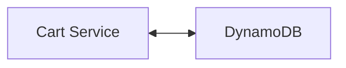

# Cart Service
### Description
The **Cart Service** is responsible for viewing, adding, editing and 
removing items from the user's shopping carts.

## Architecture


## DynamoDB Tables
### Users Table
**Cart Service** reuses the **Users** table for storing the shopping cart items.

- **PK (Partition Key):** The partition key, the **Cart Service** only 
interacts with users so is always the userId (the user email prefixed with USER#).
- **SK (Sort Key):** The sort key, in the **Cart Service** it's the productId 
prefixed with #CART_ITEM.
- **Quantity:** Required Number attribute identifies the quantity 
associated for the particular item in this shopping cart.

## API
```
CartItem = { productId, quantity }
```

### View the shopping cart
```
GET /cart
Authorization: user

Returns:
    OK(List<CartItem>)
    UNAUTHORIZED: if no user access token was passed in the Authorization header.
```
### Update the shopping cart
```
PATCH /cart
Authorization: user
body: CartItem 

Returns:
    OK
    UNAUTHORIZED
```

