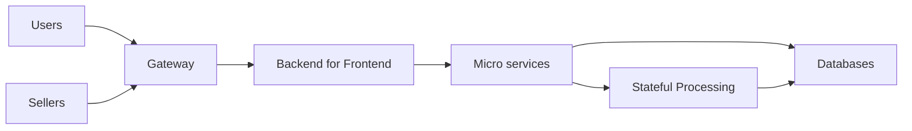

# SellerSphere Arhirecture

SellerSphere must be able to handle a million of users and products 
with high availability, fault-tolerance (no order must be lost) and low latency.

## High Level Overview

### Backend For Frontend
- Users App 
- Sellers App
- Admins App

### Micro Services
- [User Service (User Management)](../user-service/README.md)
- [Cart Service (Cart Management)](../cart-service/README.md)
- [Product Service (Product Management)](../product-service/README.md)
- [Order Service (Order Management)](../order-service/README.md)

### Databases
- DynamoDB (Users, Sellers, AuthSessions, Carts, Orders)
- MongoDB (Products)
- S3 (Product Images)

### Real time Processing
- Apache Kafka
- Apache Flink

