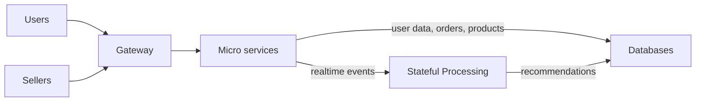

# StreamCart Arhirecture

StreamCart must be able to handle a million of users and products 
with high availability, fault-tolerance (no order must be lost) and low latency.

## High Level Overview

### Micro Services
- User Service (User Management)
- Cart Service (Cart Management)
- Product Service (Product Management)
- Order Service (Order Management)

### Databases
- DynamoDB (Users, Sellers, AuthSessions, Carts, Orders)
- MongoDB (Products)
- S3 (Product Images)

### Real time Processing
- Apache Kafka
- Apache Flink