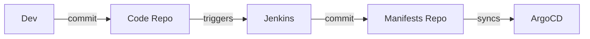
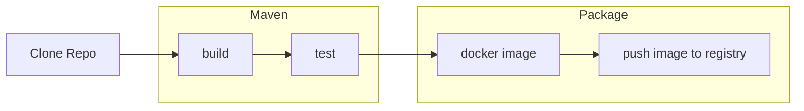

# Seller Sphere CI/CD

## Release Lifecycle

```mermaid
flowchart LR
Dev -- commit --> G[Code Repo]
G -- triggers --> J[Jenkins]
J -- commit --> D[Manifests Repo]
D -- syncs --> ArgoCD
```

## Jenkins Pipeline

```mermaid
flowchart LR
C[Clone Repo] --> B[build]
subgraph Maven
B-->U[test]
end
U-->D[docker image]
subgraph Package
D-->PI[push image to registry]        
end

```