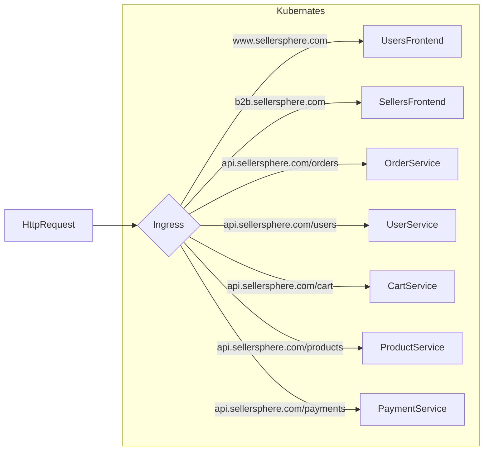

# Seller Sphere Kubernetes Deployment

## Request Routing

```mermaid
flowchart LR
HttpRequest-->I{Ingress}
subgraph Kubernates
I -- www.sellersphere.com --> UsersFrontend
I -- b2b.sellersphere.com --> SellersFrontend   
I -- api.sellersphere.com/orders -->OrderService
I -- api.sellersphere.com/users -->UserService
I -- api.sellersphere.com/cart -->CartService
I -- api.sellersphere.com/products -->ProductService
I -- api.sellersphere.com/payments -->PaymentService
end
```

