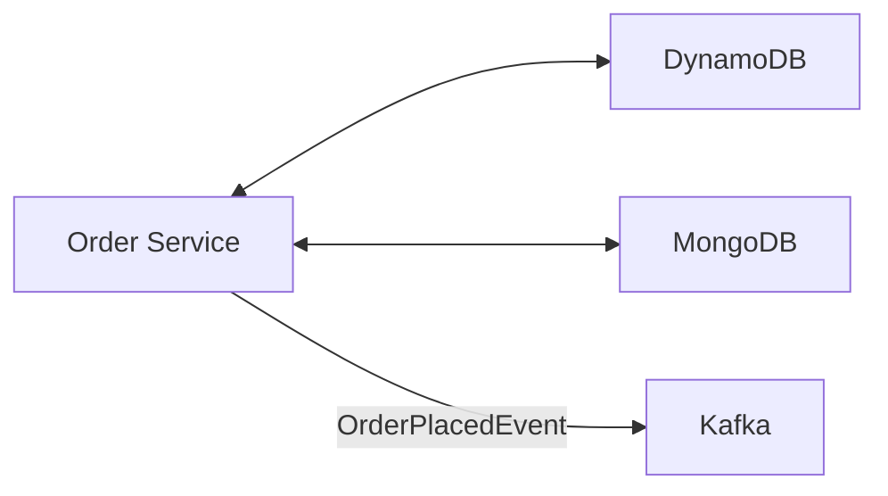
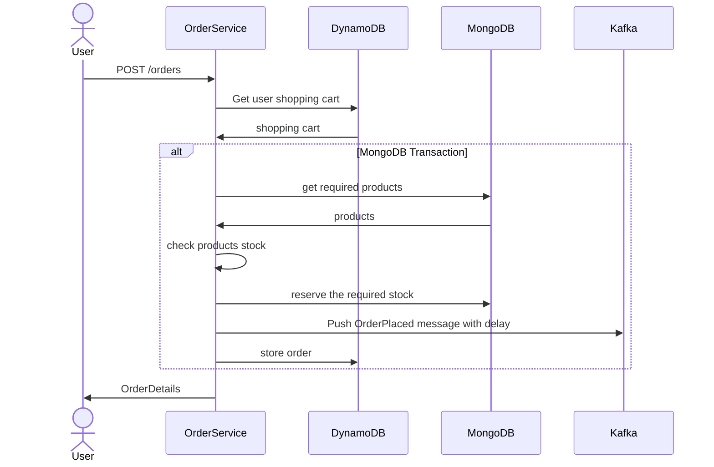
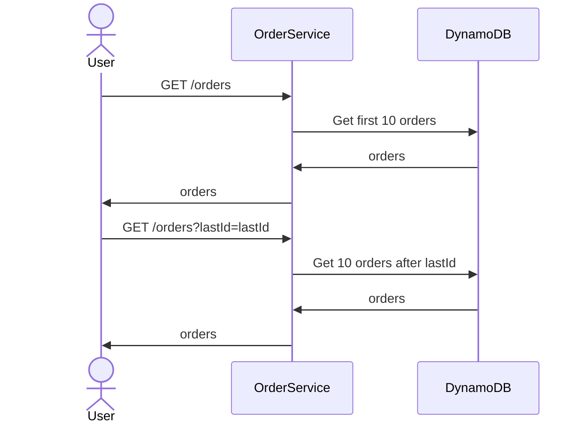

# OrderService
The **Order Service** is responsible for the following:
- Place new order (reserve items stock) 
- View order history for a user

## Archirecture


## Operations
### Place Order


### View orders


## DynamoDB Tables
### Users Table
**PK (Partition Key):**
**OrderStatus:** PENDING_PAYMENT -> PAYMENT_IN_PROGRESS -> PAYMENT_COMPLETE / CANCELED

| PK                 | SK                   | OrderStatus     | PlacedAt    | TotalPrice | Items       |
|--------------------|----------------------|-----------------|-------------|------------|-------------|
| USER#bob@bmail.com | ORDER#20240917123456 | PENDING_PAYMENT | {UnixEpoch} | 500        | OrderItem[] |
## API
```
GET /orders?lastId&year&month&day
Authorization: user
```

```
POST /orders
Authorization: user
```