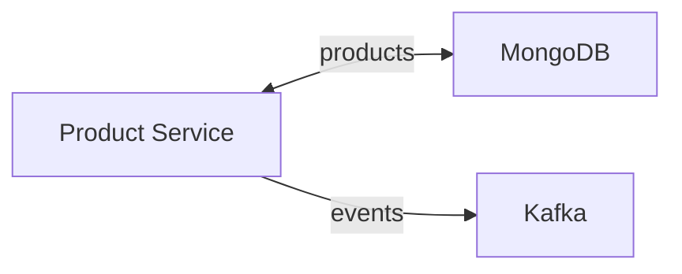
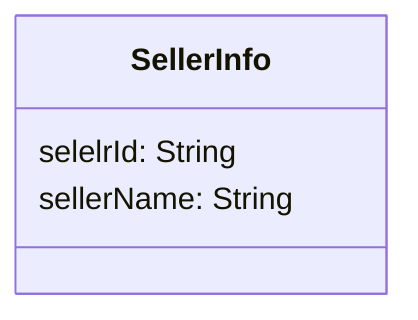
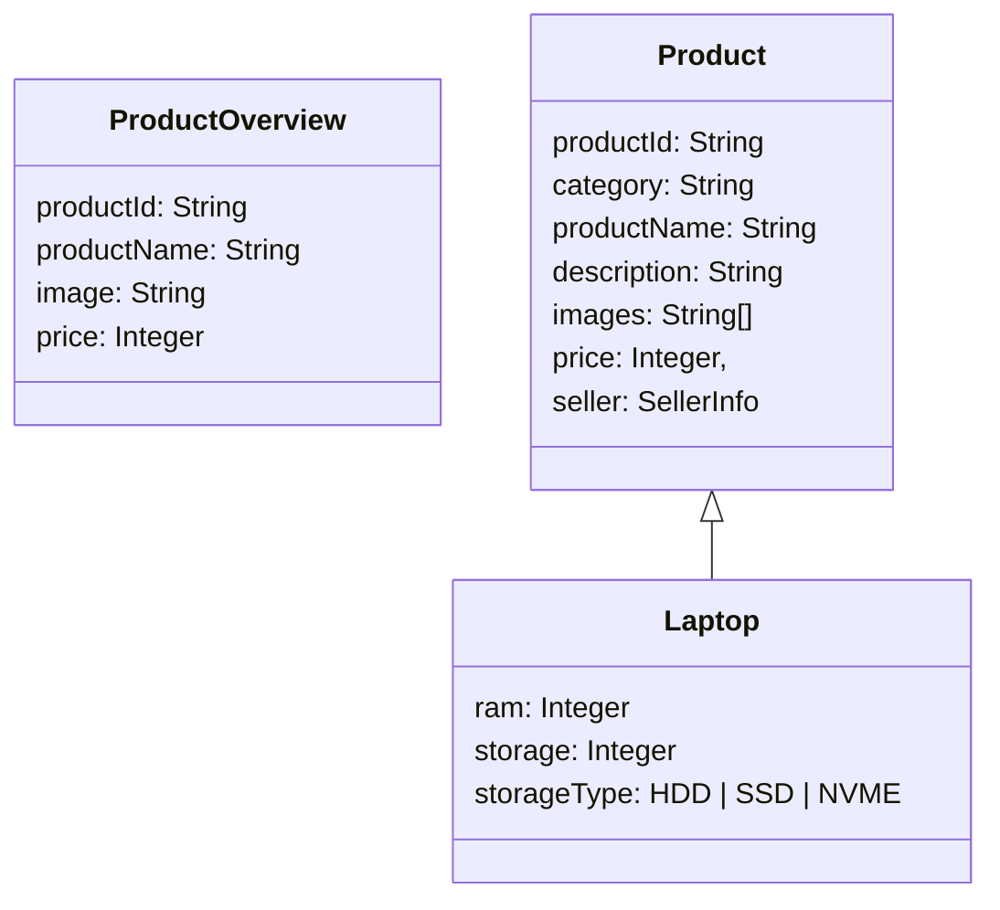
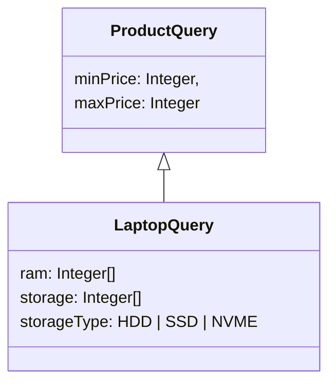

# Product Service
### Description
The **Product Service** is responsible for the following:
- CRUD (Create, Read, Update, Delete) operations for products.
- Categorization of products (e.g., electronics, clothing, etc.).
- Product search and filtering capabilities.

## Architecture


## MongoDB Collections
### products
The **products** collections is used to hold (you guess it) the products of the platform.

- **_id (ObjectId):** The unique identifier for each product.
- **category (String):** A string that identifies the category of the product.
- **quantity (Integer):** The stock available for the product.
- **price (Integer):** The price of the product in cents (EURO).
- **productName (String):** The name of the product.
- **images (String[]):** URL of images associeted with the product. 
- **description (String):** The description of the product.
- **seller (SellerInfo):** nested document that contains information about the seller.

### Nested documents


### Indexed fields
- **category (Normal Index)**

- **productName, description (Text Index)**

## Kafka events
```
ProductView: {
    timestamp: Long, # The timestamp in Unix epoch time when the product was viewed 
    productId: String, # the _id of the product that was viewed (ObjectId#toHexString)
    category: String, # The category of the product
    userId: String | null # the user if identifieable that viewed the product
}
```

## API
### Product Entities

### Product Queries



### Search a product by text
```
GET /products/search?text

Returns: 
    OK: 
        body: List<ProductOverview>
    BAD_REQUEST:
        
```

### Search and filter products in a category
```
GET /products/search/{category}?ProductQuery

Returns:
    Ok: List<ProductOverview>
    NOT_FOUND: if no such category exists
    BAD_REQUEST: Invalid ProductQuery
```

### Get the product by id
```
GET /products/{productId}

Returns:
    OK: Product
    BAD_REQUEST
    NOT_FOUND
```

### Get multiple products by id
```
GET /products/batch?productIds

Returns:
    OK: Product[]
    BAD_REQUEST
```

### Create a new product for a category
```
PUT /products/{category}
Authorization: seller

Returns:
    OK
    BAD_REQUEST
    UNAUTHORIZED
```

### Update an existing product
```
PATCH /products/{productId}
Authorization: seller

Returns:
    OK
    BAD_REQUEST
    UNAUTHORIZED
    FORBIDDEN
```

### Delete a product
```
DELETE /products/{productId}
Authorization: seller

Returns:
    OK
    BAD_REQUEST
    UNAUTHORIZED
    FORBIDDEN
```