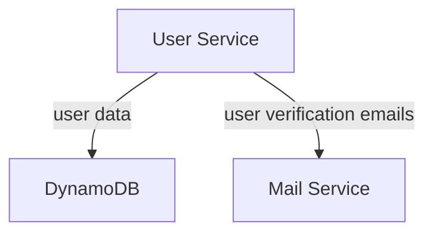

# UserService
### Description
UserService is responsible for the user management of the SellerSphere application,
specifically:
- User registration and authentication (sign up, log in, password recovery).
- User profile management (view and edit personal information).

## Architecture


## DynamoDB Tables

### Users Table
| PK                   | SK       | Name  | Birthday   | Password | DisabledReason | VerificationCode | Expiration   |
|----------------------|----------|-------|------------|----------|----------------|------------------|--------------|
| USER#bob@bmail.com   | METADATA | Bob   | 23/06/2000 | {BCrypt} | UNVERIFIED     | 863764           | {Unix Epoch} |
| USER#alise@amail.com | METADATA | Alise | 08/11/2003 | {BCrypt} |

### AuthSessions Table
| Subject              | SessionId   | RefreshNumber | Expiration   |
|----------------------|-------------|---------------|--------------|
| USER#alise@amail.com | 53253253242 | 1             | {Unix Epoch} |

## REST API
**Sign up User**
```
POST /users/signup
body: { name, birthday, email, password }
```

**Login User**
```
POST /users/login
body: { email, password }

Returns:
    X-ACCESS-TOKEN: accessToken
    X-REFRESH-TOKEN: refreshToken
    body: { name, email, birthday, userId }
```

**Verify User signup**
```
PATCH /users/verify/signup
body: { email, verificationCode }
```

**Trigger Password recovery** 
```
POST /users/recovery/password
query: email
```

**Verify password recovery**
```
PATCH /users/verify/password-recovery
body: { email, verificationCode }
```

**Change password**
```
POST /users/change/password
body: { email, verificationCode, password }
```