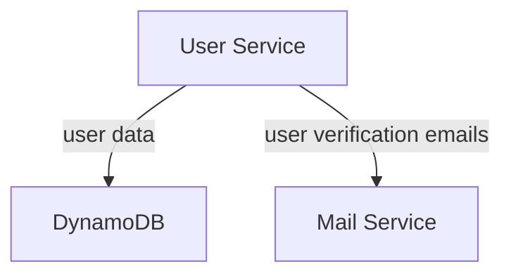
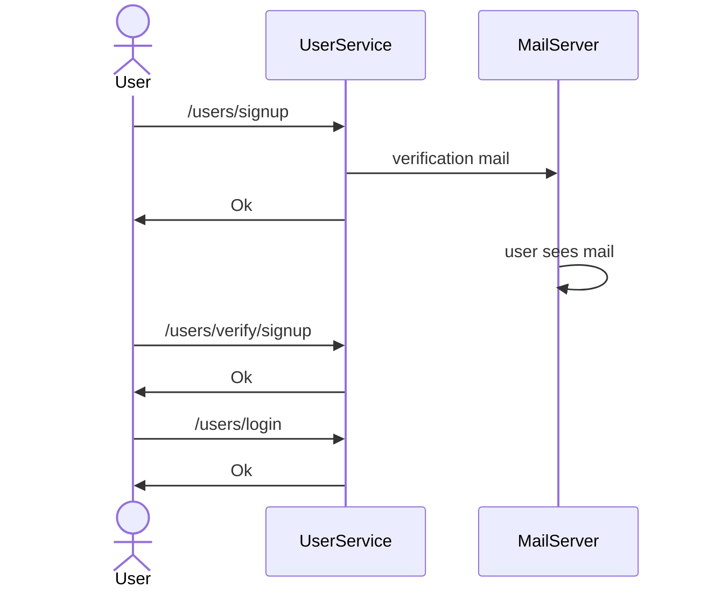
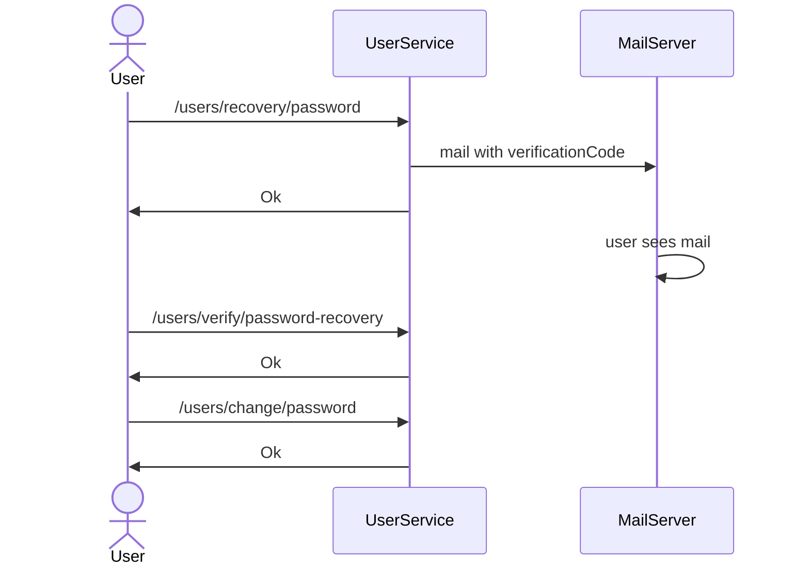

# UserService
### Description
UserService is responsible for the user management of the SellerSphere application,
specifically:
- User registration and authentication (sign up, log in, password recovery).
- User profile management (view and edit personal information).

## Architecture


## DynamoDB Tables

### Users Table
The **Users** table follows a Single Table Design and is common table for storing user-related information
for many microservices in the [SellerSphere](../README.md).

- **PK (Partition Key):** The partition key of table can store different entities, the UserService interacts with
USER entities and their PK is the user email prefixed with USER#.
- **SK (Sort Key):** The sort key of table can be used to retrieve different data associated with an entity,
the UserService interacts only with the METADATA sort key which contains the user personal information.
- **FullName:** Required String attribute that contains (you quess it) the full name of the user.
- **Birthday:** Required String attribute that contains the user birthday in format DD/MM/YYYY.
- **Password:** Required String attribute that contains the user password encoded using BCrypt.
- **DisabledReason:** Optional String attribute which identifies Disabled accounts.
- **VerificationCode:** Optional String attribute which is used for the verifying actions on the account,
like verifying the signup or password recovery. 
- **Expiration:** Optional TTL number attribute that is only present for UNVERIFIED accounts and identifies when
(in Unix epoch seconds) the account is deleted.

| PK                   | SK       | FullName | Birthday   | Password | DisabledReason | VerificationCode | Expiration   |
|----------------------|----------|----------|------------|----------|----------------|------------------|--------------|
| USER#bob@bmail.com   | METADATA | Bob      | 23/06/2000 | {BCrypt} | UNVERIFIED     | 863764           | {Unix Epoch} |
| USER#alise@amail.com | METADATA | Alise    | 08/11/2003 | {BCrypt} |


### AuthSessions Table
The **AuthSessions** Table is used for keeping track of sessions associeted with the various entities
that access the applications (users, sellers or admins).

- **Subject (Partition Key):** The partition key of the table contains an identifier of the subject
that is associeted with a session.
- **SessionId (Sort Key):** The sort key of the table is unique String identifier for an authentication session.
- **RefreshNumber:** Required Number attribute used to limit the refreshes of a refresh token and to
detect refresh token reuses.
- **Expiration:** Required TTL Number attribute used to determine the expiration of the session in Unix epoch time.

| Subject              | SessionId   | RefreshNumber | Expiration   |
|----------------------|-------------|---------------|--------------|
| USER#alise@amail.com | 53253253242 | 1             | {Unix Epoch} |

## Operations

### Signup a user


### Password recovery


## REST API
**Sign up User**
```
POST /users/signup
body: { fullname, birthday, email, password }

Returns:
    CREATED: the signup is created and a verification email is send.
    BAD_REQUEST: if a parameter is missing or is invalid.
    CONFLICT: if another verified account has the same email. 
```

**Login User**
```
POST /users/login
body: { email, password }

Returns:
    OK: login was successfull
        X-ACCESS-TOKEN: accessToken
        X-REFRESH-TOKEN: refreshToken
        body: { fullname, email, birthday, userId }
    BAD_REQUEST: a parameters is missing or is invalid
    FORBIDDEN: login unsuccessful
```

**Verify User signup**
```
PATCH /users/verify/signup
body: { email, verificationCode }

Returns:
    OK: verification success
    BAD_REQUEST: a parameter is missing or is invalid
    CONFLICT: the verificationCode was expired, is invalid or the email is already verified
```

**Trigger Password recovery** 
```
POST /users/recovery/password
body: { email }

Returns:
    OK: password recovery was triggered
    BAD_REQUEST: email is missing or is invalid
```

**Verify password recovery**
```
PATCH /users/verify/password-recovery
body: { email, verificationCode }

Returns:
    OK(recoveryCode): verificationCode is valid
    BAD_REQUEST: a parameter is missing or is invalid, or no password recovery was triggered for this email.
```

**Change password**
```
POST /users/change/password
body: { email, recoveryCode, password }

Returns:
    OK: password was changed
    BAD_REQUEST: a parameter is missing or is invalid
```